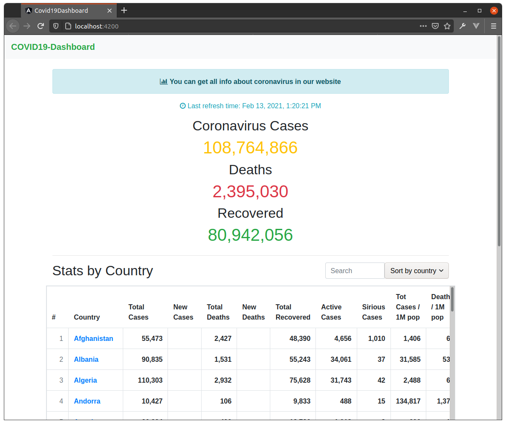

# COVID19-Dashboard

COVID19 dashboard written with angular. API used: http://disease.sh

## Running locally
Download source code:

    git clone https://github.com/drdilyor/covid19-dashboard
    cd covid19-dashboard

Install angular cli if not already installed:

    npm install -g @angular/cli

Install required packages:

    npm install

Finally, run development server:

    ng serve

and navigate to http://localhost:4200

## Deployment
    ng build --prod

Then, you get dist/ folder to deploy to **netlify**, that's all *:)*

The project is already deployed to https://drdilyor-covid.netlify.app

> This project is created with **"Intense course for OMUC students"**.
> **Mentor**: Ulugbek Samigjanov
